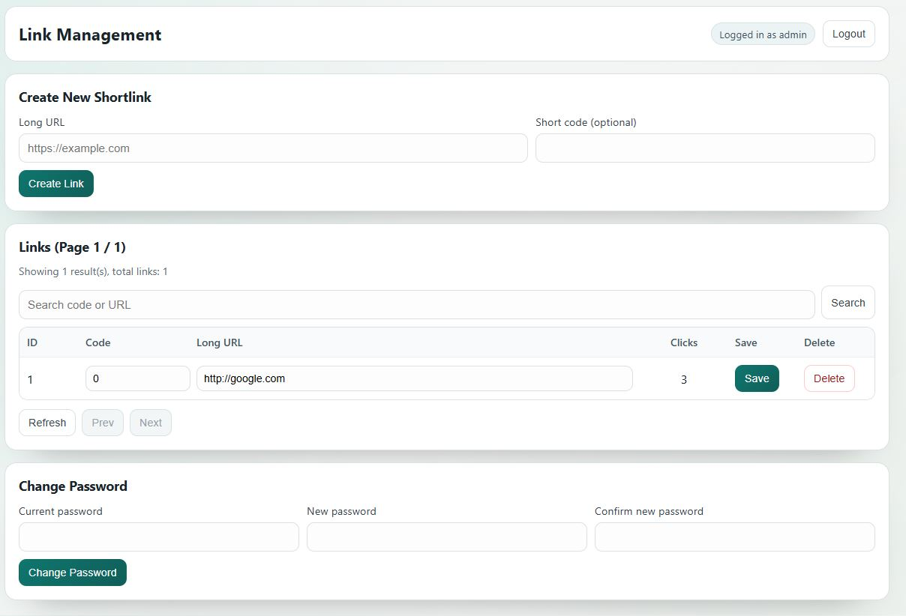

# Shortener 



I couldn't find a basic url shortener I was happy with. 

golang url shortener, run the binary, it auto creates and stores links in a sqlite db

Sample nginx reverse proxy code
```
location / {
        proxy_pass http://127.0.0.1:3000;
        proxy_http_version 1.1;

        proxy_set_header Host $host;
        proxy_set_header X-Real-IP $remote_addr;
        proxy_set_header X-Forwarded-For $proxy_add_x_forwarded_for;
        proxy_set_header X-Forwarded-Proto $scheme;

        proxy_set_header Upgrade $http_upgrade;
        proxy_set_header Connection "upgrade";
    }

----------------------
        location ^~ /short/ {
            proxy_pass http://127.0.0.1:3001;
            proxy_http_version 1.1;
            proxy_set_header Host $host;
            proxy_set_header X-Real-IP $remote_addr;
            proxy_set_header X-Forwarded-For $proxy_add_x_forwarded_for;
            proxy_set_header X-Forwarded-Proto $scheme;
            proxy_set_header Upgrade $http_upgrade;
            proxy_set_header Connection "upgrade";
        }
        location = /short {
            return 301 /short/;
        }
```
